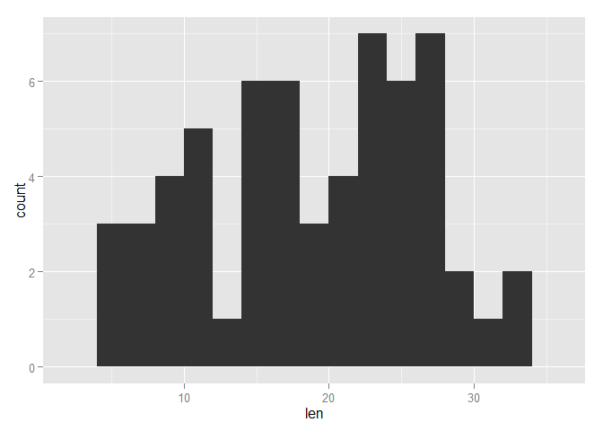
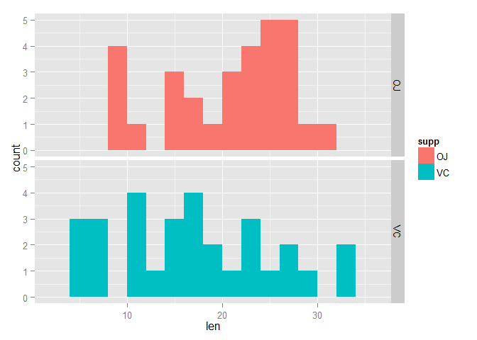
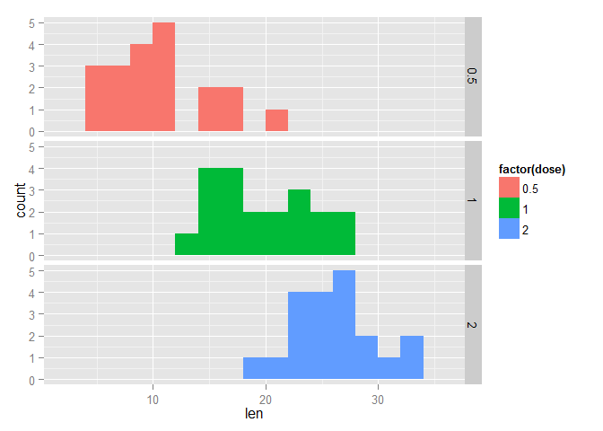
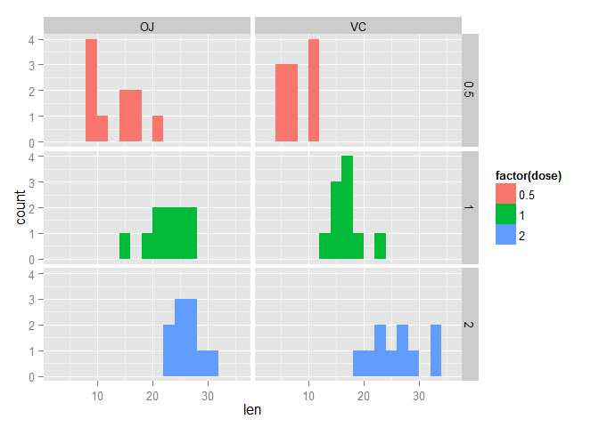

# Basic Inferential Data Analysis of the Tooth Growth Dataset

In this peer assignment, we are required to perform some exploratory data analysis and perform some Student's t-tests to see if mean differs when conditioned with different variables.

Firstly, let us look at the Tooth Growth dataset.
As provided by the description of the dataset: "the response is the length of odontoblasts (teeth) in each of 10 guinea pigs at each of three dose levels of Vitamin C (0.5, 1, and 2 mg) with each of two delivery methods (orange juice or ascorbic acid)."


```r
library(ggplot2)

data(ToothGrowth)
attach(ToothGrowth)

table(list(supp,dose))
```

```
##     .2
## .1   0.5  1  2
##   OJ  10 10 10
##   VC  10 10 10
```

Indeed, the dataset has 10 values for each combination of combination of categorical variables, supplement type and dose.

Exploratory data analysis is done by plotting histograms of the measured value at the gross level, as well as separated by the 2 categorical variables.


```r
g1 <- ggplot(ToothGrowth)
g1 + geom_histogram(aes(x=len), binwidth=2)
```

 

```r
g1 + geom_histogram(aes(x=len, fill=supp), binwidth=2) + facet_grid(supp~.)
```

 

```r
g1 + geom_histogram(aes(x=len, fill=factor(dose)), binwidth=2) + facet_grid(dose~.)
```

 

```r
g1 + geom_histogram(aes(x=len, fill=factor(dose)), binwidth=2) + facet_grid(dose~supp)
```

 

The gross histogram plot does not give much information about length of odontoblasts, it is quite varied.
When conditioned on the supplement type, the histogram does not show much difference in the mean of length, but the variance for ascorbic acid is higher.
When conditioned on dosage level, there are observable differences in the mean of length at different dosage levels.
In the final grid plot, where length is conditioned on both variables, dosage levels also showed clear difference in means, and the spread is wider for ascorbic acid.

The following results quantify these differences, when mean is computed while conditioned on the categories:

```r
aggregate(len ~ supp, data=ToothGrowth, mean)
```

```
##   supp   len
## 1   OJ 20.66
## 2   VC 16.96
```

```r
aggregate(len ~ dose, data=ToothGrowth, mean)
```

```
##   dose   len
## 1  0.5 10.61
## 2  1.0 19.73
## 3  2.0 26.10
```

```r
aggregate(len ~ dose + supp, data=ToothGrowth, mean)
```

```
##   dose supp   len
## 1  0.5   OJ 13.23
## 2  1.0   OJ 22.70
## 3  2.0   OJ 26.06
## 4  0.5   VC  7.98
## 5  1.0   VC 16.77
## 6  2.0   VC 26.14
```

T-tests were perform on each of these variables to investigate if there are statistical difference in means between the datasets.
Since there are 3 levels for dosage, it is necessary to subset the data to include just 2 of the categories before performing the t-tests.

```r
tg0.51 <- subset(ToothGrowth, dose!=2)
tg0.52 <- subset(ToothGrowth, dose!=1)
tg12 <- subset(ToothGrowth, dose!=0.5)

t.test(len ~ supp, data=ToothGrowth)
```

```
## 
## 	Welch Two Sample t-test
## 
## data:  len by supp
## t = 1.915, df = 55.31, p-value = 0.06063
## alternative hypothesis: true difference in means is not equal to 0
## 95 percent confidence interval:
##  -0.171  7.571
## sample estimates:
## mean in group OJ mean in group VC 
##            20.66            16.96
```

```r
t.test(len ~ dose, data=tg0.51)
```

```
## 
## 	Welch Two Sample t-test
## 
## data:  len by dose
## t = -6.477, df = 37.99, p-value = 1.268e-07
## alternative hypothesis: true difference in means is not equal to 0
## 95 percent confidence interval:
##  -11.984  -6.276
## sample estimates:
## mean in group 0.5   mean in group 1 
##             10.61             19.73
```

```r
t.test(len ~ dose, data=tg0.52)
```

```
## 
## 	Welch Two Sample t-test
## 
## data:  len by dose
## t = -11.8, df = 36.88, p-value = 4.398e-14
## alternative hypothesis: true difference in means is not equal to 0
## 95 percent confidence interval:
##  -18.16 -12.83
## sample estimates:
## mean in group 0.5   mean in group 2 
##             10.61             26.10
```

```r
t.test(len ~ dose, data=tg12)
```

```
## 
## 	Welch Two Sample t-test
## 
## data:  len by dose
## t = -4.901, df = 37.1, p-value = 1.906e-05
## alternative hypothesis: true difference in means is not equal to 0
## 95 percent confidence interval:
##  -8.996 -3.734
## sample estimates:
## mean in group 1 mean in group 2 
##           19.73           26.10
```

Based on the tests result, we can conclude that supplement type does not show significant difference in length of teeth. On the other hand, dosage levels showed significant differences when comparing between any 2 sets of dosage levels. Increase in dosage level leads to an increase in length of teeth.

There are some assumptions we had to make for the conclusion to be generalised. Firstly, we are assuming that the experiment is performed fairly, and the data collected from it is representative of the population of guinea pigs. 

Since the data set is small , it is necessary that we assumed that the population of teeth length is a normal distribution before we can perform t-tests. Else, an exact test (or other forms of tests) would be necessary. We made no assumptions on whether the different categories have similar variances and the t-tests have accounted for possible differences.
