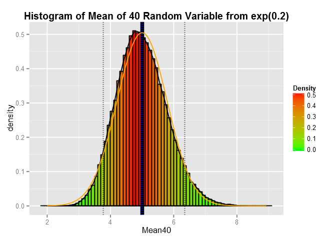

# Simulation Exercise for exp(0.2)

For this peer assignment, we are required to perform a simulation exercise for the exponential distribution with lambda = 0.2. Below are the codes to generate the random variables.

```r
#importing the necessary libraries
library(ggplot2)
library(Cairo)

lambda <- 0.2
nsim <- 100000 
expdata <- matrix(rexp(40*nsim,lambda),40)
expmean <- data.frame(Mean40=colMeans(expdata))
```

For this exercise, we generate 10<sup>5</sup> sets of 40 random variables from the exponential distribution. We then compute the mean for each set of variables

From the random variables generated, it is then possible to compute the sample mean and variance of the variables.

```r
theo.mean <- 1/lambda
theo.var <- lambda^(-2)/40
sample.mean <- colMeans(expmean)
sample.var <- var(expmean$Mean40)
```

The sample mean is 4.9955 with variance 0.6214. We know that the theoretical mean of an exponential distribution is 1/lambda = 5, and the variance is 0.625.

We then generate the theoretical normal distribution based on these properties to be included into the final empirical plot.

```r
normdist <- dnorm(expmean$Mean40, mean=theo.mean, sd=sqrt(theo.var))
```

And plot everything together here:

```r
quantiles <- quantile(expmean$Mean40,c(0.05,0.95))
g1 <- ggplot(expmean, aes(x=Mean40))
g1 + geom_histogram(aes(y=..density.., fill=..density..), binwidth=0.1, 
                    color="black") + 
    scale_fill_gradient("Density", low="green", high="red") + geom_density() +
    geom_vline(xintercept=theo.mean, size=2) + 
    geom_vline(xintercept=sample.mean, size=1.5, linetype="dotted", color="blue") +
    geom_vline(xintercept=quantiles, linetype="dotted") +
    geom_line(aes(x=expmean$Mean40, y=normdist), color="orange") +
    ggtitle("Histogram of Mean of 40 Random Variable from exp(0.2)") + 
    theme(plot.title = element_text(face="bold"))
```

 

The plot is coloured such that the bin with the highest density is red while the lowest is green. This shows very clearly that the highest density is somewhere about the mean of the sample mean (plotted with a thick black bar). Overlayed on top of the sample mean line is also a dotted blue line, which is the theoretical mean of 5. (The theoretical and sample mean values are almost the same.)

Besides the mean values, the thinner dotted lines on both sides of the plot is the 5th and 95th percentile of the sample respectively.

The orange line is the theoretical normal distribution with mean = 5 and variance = 0.625. You can see that the empirical distribution is almost similar to the normal distribution.


The sample and theoretical variance are almost the same, with the sample at `r var.ratio' of the theoretical value.

Computing the 95% CI: 

```r
CI <- theo.mean + c(-1,1)*1.96*sqrt(sample.var/40)
CI <- data.frame(Lower=CI[1],Upper=CI[2])
```
The 95% CI of 4.7557, 5.2443 includes the theoretical mean.
